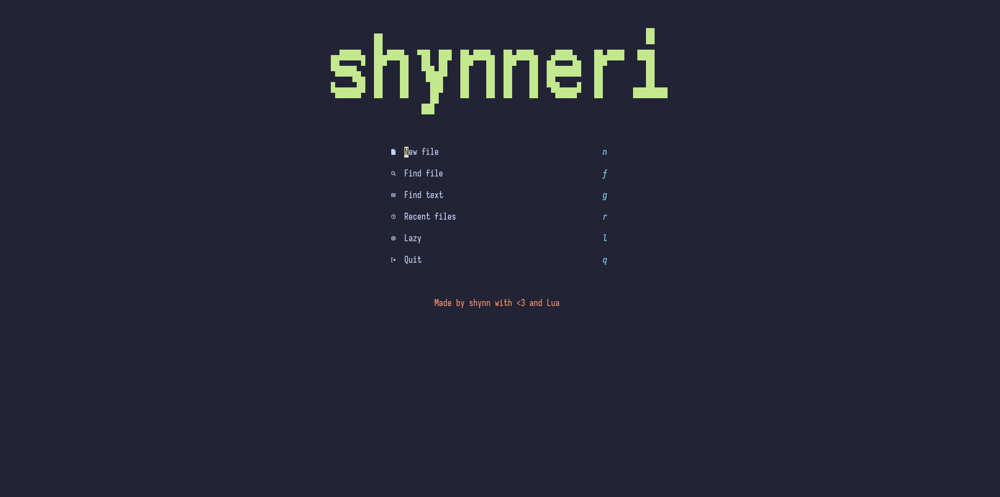

<div align="center">

<picture>
  <source media="(prefers-color-scheme: dark)" srcset="https://readme-typing-svg.demolab.com/?font=Iosevka+Nerd+Font&weight=600&size=40&duration=3000&pause=1000&color=7AA2F7&center=true&vCenter=true&width=800&height=100&lines=%E2%9C%A8+shynneri+%E2%9C%A8;Beautiful+Neovim+Configuration;Crafted+with+%E2%9D%A4%EF%B8%8F+and+Lua">
  
</picture>

<br/>

<h3 align="center">
  <i>A beautiful, powerful Neovim configuration crafted with love</i> ❤️
</h3>



[](https://neovim.io)
[](http://www.lua.org)
[](https://github.com/folke/lazy.nvim)

</div>

---

A modern, feature-rich Neovim configuration built with Lua and powered by lazy.nvim. This configuration provides a complete IDE-like experience with LSP support, beautiful UI, and efficient workflows for multiple programming languages.

## Introduction

Shynneri Nvim is a carefully crafted Neovim configuration designed for developers who want a powerful, fast, and beautiful editing experience. It comes pre-configured with modern plugins, sensible defaults, and an intuitive keymap system that enhances productivity.

This configuration supports multiple programming languages including C/C++, Go, Python, and Lua, with full LSP (Language Server Protocol) integration, code formatting, syntax highlighting, and git integration.

## Features

- 🚀 **Lazy Loading**: Fast startup time with lazy.nvim plugin manager
- 🎨 **Beautiful UI**: Tokyo Night theme with custom dashboard, statusline, and bufferline
- 📝 **LSP Support**: Full language server support for multiple languages
- 🔍 **Fuzzy Finding**: Telescope integration for fast file and text searching
- 🌳 **Syntax Highlighting**: Tree-sitter powered syntax highlighting
- 🎯 **Code Formatting**: Automatic code formatting with conform.nvim
- 📦 **Git Integration**: Built-in git signs and commands
- 🔧 **Easy Customization**: Modular configuration structure
- ⚡ **Terminal Integration**: Built-in floating terminal with toggleterm
- 🗂️ **File Explorer**: Mini.files for quick file navigation

## Requirements

Before installing this configuration, make sure you have the following installed on your system.

### For Linux (Ubuntu/Debian)

#### Essential Requirements

1. **Neovim** (>= 0.9.0)
   ```bash
   sudo apt update
   sudo apt install neovim
   ```
   Or for the latest version:
   ```bash
   sudo add-apt-repository ppa:neovim-ppa/unstable
   sudo apt update
   sudo apt install neovim
   ```

2. **Git**
   ```bash
   sudo apt install git
   ```

3. **A Nerd Font**
   - Required for icons to display properly
   - **Recommended: [Iosevka Nerd Font](https://www.nerdfonts.com/)** ⭐
   - Alternative: [JetBrains Mono Nerd Font](https://www.nerdfonts.com/)
   - Install on Ubuntu:
   ```bash
   mkdir -p ~/.local/share/fonts
   cd ~/.local/share/fonts
   wget https://github.com/ryanoasis/nerd-fonts/releases/download/v3.1.1/Iosevka.zip
   unzip Iosevka.zip
   rm Iosevka.zip
   fc-cache -fv
   ```
   - Configure your terminal to use the Nerd Font

4. **Node.js** (>= 14.x)
   ```bash
   sudo apt install nodejs npm
   ```
   Or for the latest LTS version:
   ```bash
   curl -fsSL https://deb.nodesource.com/setup_lts.x | sudo -E bash -
   sudo apt install -y nodejs
   ```

5. **Python 3**
   ```bash
   sudo apt install python3 python3-pip python3-venv
   ```

### For macOS

#### Essential Requirements

1. **Neovim** (>= 0.9.0)
   ```bash
   brew install neovim
   ```

2. **Git** (usually pre-installed)
   ```bash
   brew install git
   ```

3. **A Nerd Font**
   - Download and install from [Nerd Fonts](https://www.nerdfonts.com/)
   - Or use Homebrew:
   ```bash
   brew tap homebrew/cask-fonts
   brew install --cask font-iosevka-nerd-font
   ```
   - Configure your terminal to use the Nerd Font

4. **Node.js** (>= 14.x)
   ```bash
   brew install node
   ```

5. **Python 3**
   ```bash
   brew install python3
   ```

### For Windows

#### Essential Requirements

1. **Neovim** (>= 0.9.0)
   - Download from [Neovim Releases](https://github.com/neovim/neovim/releases)
   - Or use Chocolatey:
   ```powershell
   choco install neovim
   ```
   - Or use Scoop:
   ```powershell
   scoop install neovim
   ```
   - Or use Winget:
   ```powershell
   winget install Neovim.Neovim
   ```

2. **Git**
   - Download from [Git for Windows](https://gitforwindows.org/)
   - Or use Chocolatey:
   ```powershell
   choco install git
   ```
   - Or use Winget:
   ```powershell
   winget install Git.Git
   ```

3. **A Nerd Font**
   - Download from [Nerd Fonts](https://www.nerdfonts.com/)
   - Extract the font files
   - Right-click on `.ttf` files and select "Install"
   - Or install via Scoop:
   ```powershell
   scoop bucket add nerd-fonts
   scoop install Iosevka-NF
   ```
   - Configure your terminal (Windows Terminal, PowerShell, etc.) to use the Nerd Font

4. **Node.js** (>= 14.x)
   - Download from [nodejs.org](https://nodejs.org/)
   - Or use Chocolatey:
   ```powershell
   choco install nodejs
   ```
   - Or use Winget:
   ```powershell
   winget install OpenJS.NodeJS
   ```

5. **Python 3**
   - Download from [python.org](https://www.python.org/downloads/)
   - Or use Chocolatey:
   ```powershell
   choco install python
   ```
   - Or use Winget:
   ```powershell
   winget install Python.Python.3.11
   ```

6. **C/C++ Compiler** (for building native plugins)
   - Install [Visual Studio Build Tools](https://visualstudio.microsoft.com/downloads/#build-tools-for-visual-studio-2022)
   - Or use Chocolatey:
   ```powershell
   choco install visualstudio2022buildtools
   ```

### Language-Specific Requirements

Depending on which languages you plan to use, install the following:

#### For C/C++ Development

**Linux:**
```bash
sudo apt install build-essential clang clangd
```

**macOS:**
```bash
brew install llvm
```

**Windows:**
- Install [Visual Studio Build Tools](https://visualstudio.microsoft.com/downloads/#build-tools-for-visual-studio-2022) with C++ workload
- Or use Chocolatey:
```powershell
choco install llvm
```

#### For Go Development

**Linux:**
```bash
wget https://go.dev/dl/go1.21.5.linux-amd64.tar.gz
sudo rm -rf /usr/local/go
sudo tar -C /usr/local -xzf go1.21.5.linux-amd64.tar.gz
echo 'export PATH=$PATH:/usr/local/go/bin' >> ~/.bashrc
source ~/.bashrc
```

**macOS:**
```bash
brew install go
```

**Windows:**
- Download from [go.dev](https://go.dev/dl/)
- Or use Chocolatey:
```powershell
choco install golang
```
- Or use Winget:
```powershell
winget install GoLang.Go
```

#### For Python Development

**Linux:**
```bash
sudo apt install python3.8 python3-pip
```

**macOS:**
```bash
brew install python@3.11
```

**Windows:**
Already installed if you followed the essential requirements above.

### Optional but Recommended

**Linux:**
```bash
# ripgrep - For faster grep searching in Telescope
sudo apt install ripgrep

# fd - For faster file finding in Telescope
sudo apt install fd-find

# make - For building telescope-fzf-native
sudo apt install build-essential

# xclip or xsel - For clipboard support
sudo apt install xclip
```

**macOS:**
```bash
# ripgrep - For faster grep searching in Telescope
brew install ripgrep

# fd - For faster file finding in Telescope
brew install fd

# make - Usually pre-installed with Xcode Command Line Tools
xcode-select --install
```

**Windows:**
```powershell
# ripgrep - For faster grep searching in Telescope
choco install ripgrep
# Or: winget install BurntSushi.ripgrep.MSVC

# fd - For faster file finding in Telescope
choco install fd
# Or: scoop install fd

# make - For building telescope-fzf-native
choco install make
# Or use Visual Studio Build Tools (already installed if you followed C/C++ setup)
```

## Installation

### Step 1: Backup Existing Configuration

If you have an existing Neovim configuration, back it up first:

**Linux/macOS:**
```bash
mv ~/.config/nvim ~/.config/nvim.backup
mv ~/.local/share/nvim ~/.local/share/nvim.backup
mv ~/.local/state/nvim ~/.local/state/nvim.backup
mv ~/.cache/nvim ~/.cache/nvim.backup
```

**Windows (PowerShell):**
```powershell
# Backup config
Move-Item $env:LOCALAPPDATA\nvim $env:LOCALAPPDATA\nvim.backup -ErrorAction SilentlyContinue
# Backup data
Move-Item $env:LOCALAPPDATA\nvim-data $env:LOCALAPPDATA\nvim-data.backup -ErrorAction SilentlyContinue
```

### Step 2: Clone This Configuration

**Linux/macOS:**
```bash
git clone https://github.com/shynneri-source/shynneri_nvim.git ~/.config/nvim
```

**Windows (PowerShell):**
```powershell
git clone https://github.com/shynneri-source/shynneri_nvim.git $env:LOCALAPPDATA\nvim
```

### Step 3: Install Plugins

1. Open Neovim:
   
   **Linux/macOS:**
   ```bash
   nvim
   ```
   
   **Windows:**
   ```powershell
   nvim
   ```

2. The plugin manager (lazy.nvim) will automatically:
   - Install itself
   - Install all configured plugins
   - This may take a few minutes on first launch

3. Wait for all plugins to finish installing

4. Restart Neovim after installation completes

### Step 4: Install LSP Servers and Tools

Open Neovim and run:

```vim
:Mason
```

The following will be automatically installed:
- **LSP Servers**: lua_ls, clangd, pyright, gopls
- **Formatters**: stylua, clang-format, ruff, gofumpt
- **Additional Tools**: As configured in Mason

You can also manually install additional tools through the Mason UI.

## How to Use

### Opening Neovim

Simply run `nvim` in your terminal to see the beautiful dashboard with quick access options:

```bash
nvim
```

Or open a specific file:

```bash
nvim myfile.txt
```

### Basic Navigation

- Use `h`, `j`, `k`, `l` to move left, down, up, right
- Use `<Space>` as your leader key for most commands
- Press `<Space>` and wait to see available keymaps with which-key

### Opening Files

- `<Space>e` - Open file explorer in current directory
- `<Space>E` - Open file explorer in project root
- `<Space>ff` - Find files with Telescope
- `<Space>fg` - Search text in files (grep)
- `<Space>fb` - Find open buffers

### Editing and LSP

- `gd` - Go to definition
- `gr` - Show references
- `K` - Show hover documentation
- `<Space>ca` - Code actions
- `<Space>rn` - Rename symbol
- `<Space>f` - Format current file/selection

### Buffer Management

- `Shift+l` - Next buffer
- `Shift+h` - Previous buffer
- `<Space>c` - Close current buffer

### Terminal

- `<Space>t` - Toggle floating terminal
- `<Space>th` - Toggle horizontal terminal
- `<Space>tv` - Toggle vertical terminal
- `<Space>td` - Close all terminals
- `<Esc>` or `jk` - Exit terminal mode (when in terminal)

### Git Integration

- `]c` - Next git hunk
- `[c` - Previous git hunk
- `<Space>gs` - Stage hunk
- `<Space>gr` - Reset hunk
- `<Space>gp` - Preview hunk
- `<Space>gb` - Blame line

## Customization

### Changing the Theme

Edit `lua/plugins/ui.lua`:

```lua
vim.cmd.colorscheme "tokyonight"  -- Change to your preferred theme
```

Available Tokyo Night variants: `tokyonight`, `tokyonight-night`, `tokyonight-storm`, `tokyonight-day`, `tokyonight-moon`

### Modifying Keymaps

Edit `lua/config/keymaps.lua` to add or change keybindings:

```lua
vim.keymap.set('n', '<leader>pv', vim.cmd.Ex)  -- Your custom keymaps here
```

### Adjusting Editor Options

Edit `lua/config/options.lua`:

```lua
vim.opt.number = true           -- Line numbers
vim.opt.relativenumber = true   -- Relative line numbers
vim.opt.tabstop = 4            -- Tab width
-- Add more options as needed
```

### Adding New Plugins

Create a new file in `lua/plugins/` directory:

```lua
-- lua/plugins/myplugin.lua
return {
  "author/plugin-name",
  config = function()
    -- Plugin configuration
  end,
}
```

Lazy.nvim will automatically detect and load it on next startup.

### Language-Specific Configuration

- **C/C++**: Edit `lua/plugins/lang-cpp.lua`
- **Go**: Edit `lua/plugins/lang-go.lua`
- **Python**: Edit `lua/plugins/lang-python.lua`

### Customizing Dashboard

Edit `lua/plugins/dashboard.lua` to change the ASCII art or menu options.

## Configuration Structure

```
nvim/
├── init.lua                    # Entry point
├── lazy-lock.json             # Plugin version lock file
├── lua/
│   ├── config/
│   │   ├── options.lua        # Editor options
│   │   ├── keymaps.lua        # Basic keymaps
│   │   └── autocmds.lua       # Auto commands (if exists)
│   └── plugins/
│       ├── ui.lua             # Theme and UI plugins
│       ├── telescope.lua      # Fuzzy finder
│       ├── lsp.lua            # LSP configuration
│       ├── mason.lua          # LSP/tool installer
│       ├── treesitter.lua     # Syntax highlighting
│       ├── formatter.lua      # Code formatting
│       ├── bufferline.lua     # Buffer tabs
│       ├── lualine.lua        # Status line
│       ├── dashboard.lua      # Start screen
│       ├── toggleterm.lua     # Terminal
│       ├── gitsigns.lua       # Git integration
│       ├── which-key.lua      # Keymap helper
│       ├── noice.lua          # UI enhancements
│       ├── lang-cpp.lua       # C/C++ specific
│       ├── lang-go.lua        # Go specific
│       └── lang-python.lua    # Python specific
```

## Important Keymaps

### Leader Key

- **Leader**: `<Space>` (Space bar)

### File Operations

| Keymap | Description |
|--------|-------------|
| `<Space>e` | Open file explorer (current directory) |
| `<Space>E` | Open file explorer (project root) |
| `<Space>ff` | Find files |
| `<Space>fg` | Live grep (search in files) |
| `<Space>fb` | Find buffers |
| `<Space>fh` | Find help tags |

### LSP (Code Intelligence)

| Keymap | Description |
|--------|-------------|
| `gd` | Go to definition |
| `gr` | Go to references |
| `K` | Hover documentation |
| `<Space>ca` | Code action |
| `<Space>rn` | Rename symbol |
| `<Space>f` | Format file/selection |

### Buffer Management

| Keymap | Description |
|--------|-------------|
| `Shift+l` | Next buffer |
| `Shift+h` | Previous buffer |
| `<Space>c` | Close current buffer |

### Terminal

| Keymap | Description |
|--------|-------------|
| `<Space>t` | Toggle floating terminal |
| `<Space>th` | Toggle horizontal terminal |
| `<Space>tv` | Toggle vertical terminal |
| `<Space>td` | Close all terminals |
| `<Esc>` or `jk` | Exit terminal mode |

### Git

| Keymap | Description |
|--------|-------------|
| `]c` | Next git hunk |
| `[c` | Previous git hunk |
| `<Space>gs` | Stage hunk |
| `<Space>gr` | Reset hunk |
| `<Space>gS` | Stage buffer |
| `<Space>gR` | Reset buffer |
| `<Space>gp` | Preview hunk |
| `<Space>gb` | Blame line |
| `<Space>gd` | Diff this |

### Telescope (Insert Mode)

| Keymap | Description |
|--------|-------------|
| `Ctrl+k` | Move selection up |
| `Ctrl+j` | Move selection down |
| `Ctrl+q` | Send to quickfix list |

### Window Navigation

| Keymap | Description |
|--------|-------------|
| `Ctrl+h` | Move to left window |
| `Ctrl+j` | Move to bottom window |
| `Ctrl+k` | Move to top window |
| `Ctrl+l` | Move to right window |

## Troubleshooting

### Plugins Not Installing

1. Check internet connection
2. Run `:Lazy sync` to retry installation
3. Run `:Lazy clean` then `:Lazy sync` to reinstall

### LSP Not Working

1. Open Mason: `:Mason`
2. Check if language server is installed
3. Install manually if needed: navigate to server and press `i`
4. Restart Neovim

### Icons Not Showing

1. Install a Nerd Font
2. Configure your terminal to use the Nerd Font
3. Restart terminal and Neovim

### Slow Startup

1. Check plugin count: `:Lazy`
2. Review lazy-loading settings
3. Run `:Lazy profile` to see load times

## Contributing

Contributions are welcome! If you have improvements or bug fixes:

1. Fork this repository
2. Create a feature branch (`git checkout -b feature/amazing-feature`)
3. Make your changes
4. Commit your changes (`git commit -m 'Add some amazing feature'`)
5. Push to the branch (`git push origin feature/amazing-feature`)
6. Open a Pull Request

Please ensure your code follows the existing style and includes appropriate comments.

## License

This configuration is open source and available for anyone to use and modify.

## Acknowledgments

Special thanks to all the plugin authors and the Neovim community for their amazing work.

---

**Made with ❤️ and Lua by Shynn**

*Happy Coding!* ✨
